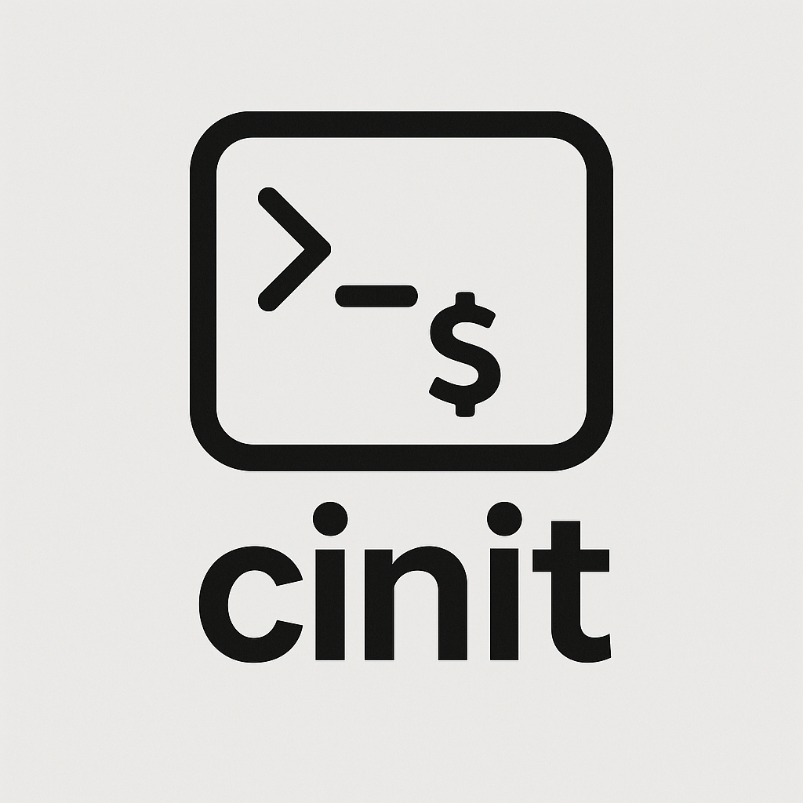

<p align="center">
  
</p>

# cinit

**cinit** is a lightweight CLI utility for quickly initializing new C or C++ projects.


## Features

- Initialize projects in the current or a new directory
- Supports both C and C++ (C is default)
- Simple, intuitive commands


## Installation

### Clone the repository:

```bash
git clone https://github.com/SzAkos04/cinit
cd cinit
```

### Build the binary:

```bash
make release
```

### Optionally add the binary to path

#### On Linux:

```bash
sudo cp build/cinit usr/local/bin
```

#### On Windows:

Add the `build/` directory to your system's environment `PATH`.


## Usage
```bash
cinit [create|c] [name] <args>
cinit [init|i] ([name]) <args>
cinit --help
```

### Commands

| Command       | Description                                              |
| ------------- | -------------------------------------------------------- |
| `init`, `i`   | Initialize a project in the **current** directory        |
| `create`, `c` | Create a project in a **new** directory                  |
| `name`        | Project name (alphanumeric or underscores, max 32 chars) |


### Options

| Option      | Description                   |
| ----------- | ----------------------------- |
| `--c`       | Set language to C *(default)* |
| `--cpp`     | Set language to C++           |
| `--help`    | Show help message             |
| `--version` | Show installed version        |


### Examples

Initialize a C project in the current directory:
```bash
cinit init my_project
```

Create a new C project in a new directory:
```bash
cinit create my_project
```

Create a new C++ project in a new directory:
```bash
cinit create my_project --cpp
```


## Notes

- Project names must contain only alphanumeric characters or underscores.

- Maximum project name length is 32 characters.
